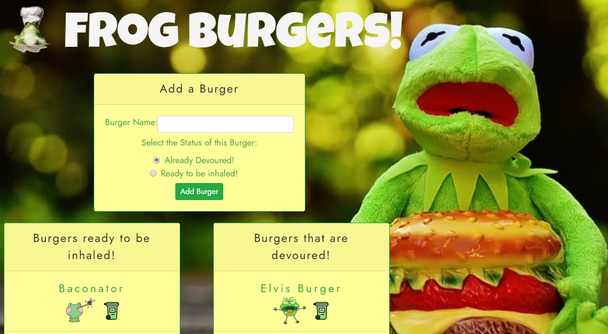
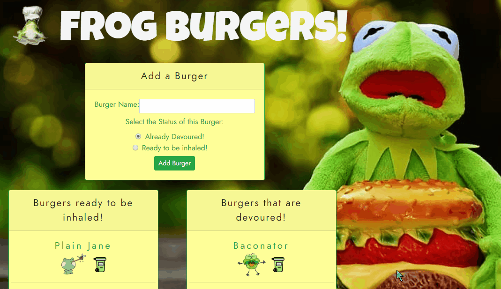

# Feed the Frog a Burger

  

## Live Link
https://burger-frogs.herokuapp.com/

## Contributors
@sammiefrog
    
## Table of Contents
<li><a href="#description">Description</a></li>  
<li><a href="#tech">Technology Stack</a></li> 
<li><a href="#usage">Usage</a></li> 
<li><a href="#contact">Contact</a></li> 
<li><a href="#screenshots">Screenshots</a></li> 
<li><a href="#tests">Tests</a></li> 
  
<h2 id= "description">Description</h2>
This is a project created using handlebars, to demonstrate how an ORM works. A user can add and delete burgers to this app, while also 'eating' and/or 'regurgitating' them.
    
<h2 id= "technology">Technology Stack</h2>
 Node.Js, Express, JavaScript, GIT, GitHub, Handlebars, HTML, CSS, Bootstrap, Heroku, Command- Line
  
<h2 id= "usage">Usage</h2>
To keep track of burgers one consumes.

<h2 id="screenshots">Screenshots</h2>

<h2 id= "tests">Tests</h2>

<h2 id= "contact">Contact</h2>
<li>Name: Sammantha Sasenick</li> 
<li>Github: https://github.com/sammiefrog</li> 
<li>Portfolio: https://sammiefrog.github.io</li>
<li>Email: <a href="mailto:ssasenick412@gmail.com" target="_blank">ssasenick412@gmail.com</a></li> 
<li>LinkedIn: https://www.linkedin.com/in/sammantha-sasenick412</li> 
 